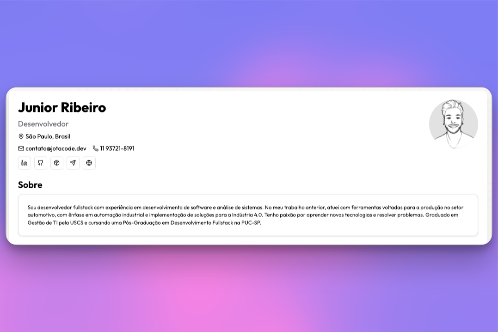

# Meu Currículo - Template Minimalista 📄

### você pode usar este template para criar seu próprio currículo, basta seguir as instruções e deixar seu star neste repo. 💫



acesse para ver um exemplo do template: [Meu Currículo](https://cv.jotacode.dev/)

## 🚀 Intro

Este é um projeto de um gerador de currículo, feito com Next.js, TypeScript e Tailwind CSS. Você pode criar currículos bonitos e responsivos com visualização em tempo real e opções de exportação. Usei componentes shadcn/ui para estilização consistente e acessibilidade.

## ✨ Funcionalidades

- 🎨 Interface moderna com suporte a modo claro/escuro
- 📱 Design responsivo
- 🔄 Visualização em tempo real
- 📥 Exportação para PDF/PNG
- 🖨️ Layout otimizado para impressão.
- 🔌 Integração com API do GitHub, caso voce armazene aqui. [Exemplo](https://github.com/codejota/Certificates/tree/main)
- ⚡ Construído com Next.js 14
- 🎯 TypeScript.
- 🎨 Tailwind CSS.
- 📦 Componentes shadcn/ui

## 🚀 Começando

### Pré-requisitos

- Node.js 18+
- npm, yarn ou pnpm

### Instalação

// fork

1. Clone o repositório:

````bash

1. Clone o repositório:

```bash
git clone
cd
````

2. Instale as dependências:

```bash
npm install
# ou
yarn install
# ou
pnpm install
```

3. Crie um arquivo `.env.local`: (caso queira usar a integração com o GitHub)

```env
NEXT_PUBLIC_GITHUB_TOKEN=seu_token_github
```

4. Inicie o servidor de desenvolvimento:

```bash
npm run dev
# ou
yarn dev
# ou
pnpm dev
```

Acesse `http://localhost:3000` para ver sua aplicação.

## 🛠️ Configuração

Edite `config/resume.ts` para personalizar o conteúdo do seu currículo:

- Informações pessoais
- Experiência profissional
- Educação
- Habilidades
- Projetos
- Certificados
- Idiomas
- Links de redes sociais

## 📦 Estrutura do Projeto

```
├── app/
│   ├── config/
│   │   └── resume.ts         # Configuração do currículo
│   ├── components/
│   │   ├── Resume.tsx        # Componente principal do currículo
│   │   ├── Certificates.tsx  # Exibição de certificados
│   │   └── ...              # Outros componentes
│   └── layout.tsx            # Layout da aplicação
├── public/                   # Ativos estáticos
├── styles/                   # Estilos globais
└── package.json             # Dependências
```

## 🎨 Personalização

### Temas

A aplicação suporta modos claro e escuro. Personalize as cores no seu `tailwind.config.js`:

```js
theme: {
  extend: {
    colors: {
      // Suas cores personalizadas
    }
  }
}
```

### Componentes

Construído com componentes shadcn/ui para estilização consistente e acessibilidade. Personalize os componentes no diretório `components/ui`.

## 📄 Licença

Este projeto está licenciado sob a Licença MIT - veja o arquivo [LICENSE](LICENSE) para detalhes.

- Caso quyera usar o template, deixe um star no repositório e fork.

## 🤝 Contribuindo

Contribuições são bem-vindas! Sinta-se à vontade para enviar um Pull Request.

1. Faça um fork do projeto
2. Crie sua branch de feature (`git checkout -b feature/AdicionadoAlgo`)
3. Faça commit de suas mudanças (`git commit -m 'Adiciona algum RecursoBacana'`)
4. Faça push para a branch (`git push origin feature/RecursoBacana`)
5. Abra um Pull Request

## 🙏 Agradecimentos

- [Next.js](https://nextjs.org/)
- [Tailwind CSS](https://tailwindcss.com/)
- [shadcn/ui](https://ui.shadcn.com/)
- [Lucide Icons](https://lucide.dev/)
- [GitHub API](https://docs.github.com/en/rest)
- Você! <3

## 📧 Contato

Se você tiver alguma dúvida ou sugestão, sinta-se à vontade para me contatar por e-mail:

- [contato@jotacode.dev](mailto:contato@jotacode.dev)
- [LinkedIn](https://www.linkedin.com/in/juniorjota/)
- Outros dados de contato disponíveis no meu curriculo :) [cv.jotacode.dev](https://cv.jotacode.dev)

```

```
